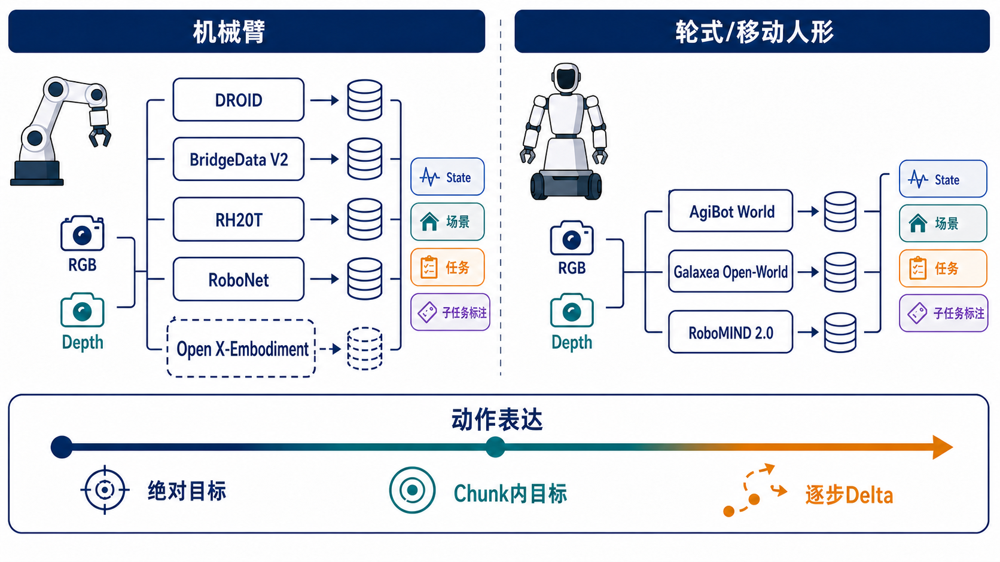

# My VLA Learning

面向机器人视觉—语言—动作模型（Vision-Language-Action, VLA）的个人学习与研究资料库，当前重点覆盖开放机器人数据集选型、VLA技术演化，以及面向Franka机械臂的动作建模路线。

## 内容导航

### 1. 开放机器人数据集综述

- [Markdown：开放机器人数据集调研与选型](docs/datasets/open_robot_dataset_review_2026-08-05.md)
- [HTML：开放机器人数据集调研与选型](docs/datasets/open_robot_dataset_review_2026-08-05.html)
- 内容：DROID、BridgeData V2、RH20T、RoboNet、Open X-Embodiment、AgiBot World、Galaxea Open-World、RoboMIND 2.0等数据集的本体、观测、动作、标注和Franka适配分析。



### 2. VLA理论与Franka技术路线

- [Markdown：VLA理论技术路线与算法综述](docs/vla-theory/VLA理论技术路线与算法综述_面向Franka_2026-08-07.md)
- [HTML：VLA理论技术路线与算法综述](docs/vla-theory/VLA理论技术路线与算法综述_面向Franka_2026-08-07.html)
- 内容：VLA演化、action chunk、Diffusion Policy、Flow Matching、Action Expert、FAST/FAST+、VQ-VAE/RVQ、ActionCodec、π0/π0.5、G0.5，以及面向Franka的实验设计建议。

## 目录结构

```text
my_vla_learning/
├── README.md
├── assets/
│   └── figures/
│       └── dataset_selection_map_v2.png
└── docs/
    ├── datasets/
    │   ├── open_robot_dataset_review_2026-08-05.md
    │   └── open_robot_dataset_review_2026-08-05.html
    └── vla-theory/
        ├── VLA理论技术路线与算法综述_面向Franka_2026-08-07.md
        └── VLA理论技术路线与算法综述_面向Franka_2026-08-07.html
```

## 阅读建议

1. 先阅读数据集综述，确定目标本体、动作坐标系和可用数据。
2. 再阅读VLA理论综述，比较离散token、直接回归和连续生成路线。
3. 面向Franka实验时，优先统一相机配置、状态定义、动作参考系、控制频率和评测协议。

> 文档按整理日期命名。领域进展较快，模型榜单与许可证应以相应项目的最新官方说明为准。
